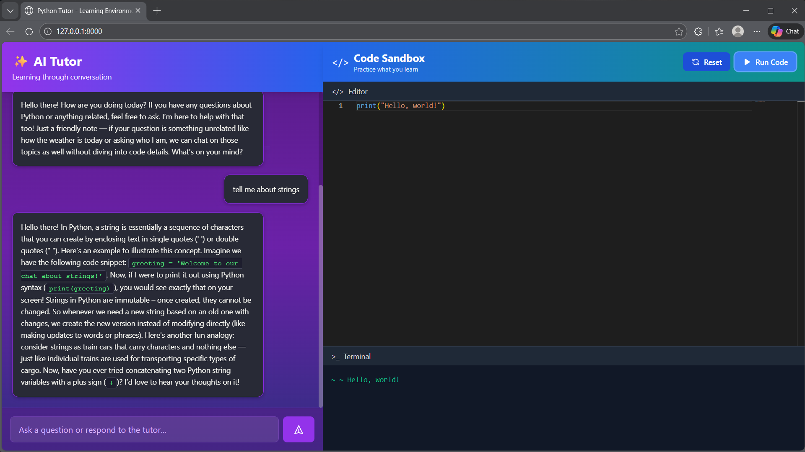

# Python AI Tutor 

An interactive **AI-powered Python learning environment** that combines a conversational tutor with a live code editor and execution sandbox.  
Built using **FastAPI** for the backend and **HTML/CSS/JavaScript** for the frontend, this project helps users learn Python through conversation, practice, and instant feedback.


---

##  Features

- Chat with an AI tutor to ask Python-related questions  
- Context-aware responses using a simple Retrieval-Augmented Generation (RAG) approach  
- In-browser Python code editor with syntax highlighting (Monaco Editor)  
- Execute Python code and view output or errors instantly  
- AI-assisted debugging suggestions for runtime errors  
- Clean, animated, and responsive UI  

---

##  How It Works (High Level)

1. The frontend UI (HTML, CSS, JS) provides:
   - Chat interface for questions  
   - Code editor for writing Python  
   - Terminal-like output section  

2. The FastAPI backend:
   - Serves the frontend files  
   - Executes Python code securely with a timeout  
   - Uses an LLM to answer questions and explain errors  

3. A simple **RAG pipeline**:
   - Markdown files from the `knowledge_base/` folder are loaded  
   - Content is embedded and stored in a vector database  
   - Relevant context is retrieved to answer user questions  

---

## 🛠 Tech Stack

### Backend
- FastAPI  
- LangChain  
- Ollama (LLM + embeddings)  
- ChromaDB (vector store)  
- Python subprocess (code execution)  

### Frontend
- HTML  
- CSS (custom styling + animations)  
- JavaScript  
- Monaco Editor  
- TailwindCSS (CDN)  

---
## Repo Structure
```
python-ai-tutor/
│
├── main.py                
├── static/
│   ├── index.html          
│   ├── app.js             
│   └── styles.css          
├── knowledge_base/         
├── outputs/                
└── README.md

```

##  Application Screenshot


